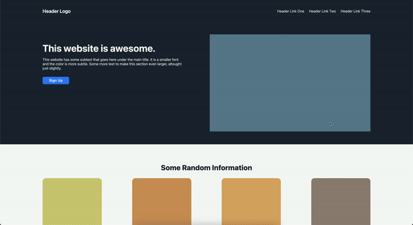

# top_landing

This repository holds the cap-stone project that was created following the [_Project: Landing Page_](https://www.theodinproject.com/lessons/foundations-landing-page) part of the [_Flexbox_](https://www.theodinproject.com/paths/foundations/courses/foundations#flexbox)course of [The Odin Project](https://www.theodinproject.com/).
The goal was to re-create a landing page from scratch using an image (see `resources`) as a reference point. As I finished to rage-code the site, I did keep on working on it, trying to make it more responsive and to maintaining best-pracises for class-naming, structuring and so on.

